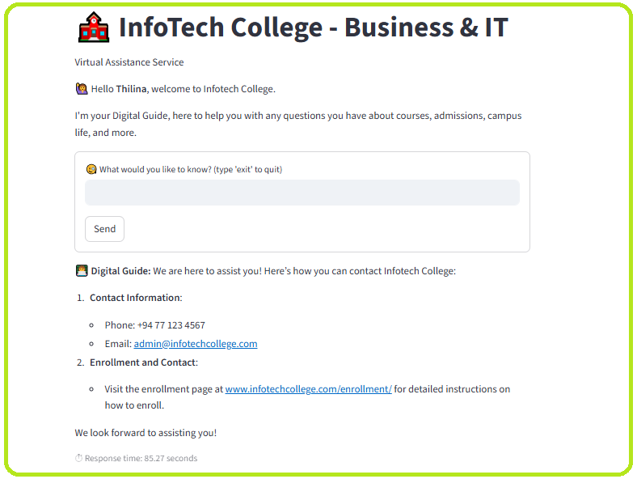

# 🤖 Developing a ChatBot for InfoTech College of Business and IT Website


```
Individual Project 03
Machine Learning with Advanced Python
Infotech College of Business & IT
```


A Retrieval-Augmented Generation (RAG) powered chatbot built for Infotech College Website, enabling students and visitors to ask questions about courses, admissions, campus life, and more.

This project showcases practical use of **Large Language Models (LLMs)**, **Vector Databases**, and **Retrieval-Augmented Generation** to build a domain-specific assistant.

[](https://drive.google.com/file/d/1cu-lLNyw4Zzq5NdTNp3v4W_iPnXPAHrT/view?usp=sharing)
[](https://drive.google.com/drive/folders/13zkRvYOpuv95XYIMl-vMVmHzPCEppjqF?usp=sharing)

---
## 📌 Features

* ✅ **Document Processing**: Loads and splits college PDFs into retrievable knowledge chunks
* ✅ **Vector Search**: Embeddings stored in **ChromaDB** for fast retrieval
* ✅ **LLM Integration**: Powered by **Ollama** with **DeepSeek-r1 (1.5B)** model
* ✅ **RAG Pipeline**: Retrieval + Prompting + Context-aware responses
* ✅ **Interactive CLI**: Ask questions directly from terminal
* ✅ **Streamlit UI**: Simple front-end interface for users
* ✅ **Clean Responses**: Custom function strips unnecessary “thinking” text from LLM outputs

---
## 📂 Project Structure

```
ML_Projects_ChatBot_for_Infotech_College/
│── 1_data/                     # PDF documents
|
│── 2_src/
│   ├── 1_chatbot/
│   │   ├── doc_load.py         # Load PDFs
│   │   ├── doc_split.py        # Split into chunks
│   │   ├── get_vectorstore.py  # Create & save embeddings
│   │   ├── integrate_llm.py    # Connect to Ollama LLM
│   │   ├── build_rag.py        # RAG pipeline
│   │   ├── clean.py            # Strip unwanted LLM text
│   │   └── chat_interactive.py # CLI chatbot
│   │   
│   └── 2_frontend/
│      └── frontend.py          # Streamlit interface (optional)
│
│── open_chatbot.py             # Final chatbot entrypoint
|
│── .git/
│── chromadb/                   # Vector database
│
│── requirements.txt            # Dependencies
│── README.md                   # Project documentation
└── cover_image.png
```

---

## 🛠️ Tech Stack

* Language: **Python 3.11**
* RAG pipeline & integrations: **LangChain**
* Vector database: **ChromaDB**
* Local LLM integration: **Ollama + DeepSeek-r1 : 1.5B model**
* Embeddings: **HuggingFace Sentence Transformers `all-MiniLM-L6-v2`**
* UI: **Streamlit**
* IDE: **Visual Studio Code + Anaconda Distribution**

---

## 🚀 Getting Started

### 1. Clone the repo

```bash
git clone https://github.com/ThilinaPerera-DataAnalytics/ML_Projects_ChatBot_for_Infotech_College.git
cd ML_Projects_ChatBot_for_Infotech_College
```

### 2. Create environment

```bash
conda create -n infochatbot python=3.11
conda activate infochatbot
```

### 3. Install dependencies

```bash
pip install -r requirements.txt
```

### 4. Setup Ollama & models

```bash
Install Ollama → [ollama.com](https://ollama.com/)

ollama pull deepseek-r1:1.5b
```

### 5. Run pipeline scripts

```bash
# Load documents
python 2_src/1_chatbot/doc_load.py

# Split into chunks
python 2_src/1_chatbot/doc_split.py

# Create vectorstore
python 2_src/1_chatbot/get_vectorstore.py

# Run chatbot interactively
python 2_src/1_chatbot/chat_interactive.py

# Run final chatbot
python open_chatbot.py
```

### 6. Run Streamlit UI

```bash
streamlit run 2_src/2_frontend/frontend.py
```

Then open: [http://localhost:8501](http://localhost:8501)

---


<font size='3'>*Streamlit Chat UI*</font>

---

## 💡 Example Queries

**Q:** *How can I enroll at Infotech College?*
<br>**A:** Visit [Enrollment Page](https://www.infotechcollege.com/enrollment/). Payment options include monthly installments, full payment, or smaller installment fees.

**Q:** *What courses are offered?*
<br>**A:** Foundation in Information Technology (FIT) program, recognized by the University of Colombo School of Computing (UCSC), plus other IT-focused offerings.

**Q:** *Can I study medicine there?*
<br>**A:** Infotech College specializes in IT & AI programs, not medicine.

---

## 📊 Performance Comparison (Head-to-Head with ollama + mistral)

<font size='4'>(Lenovo T530 i7 quad core + Samsung SSD EVO 870 512GB + Kingston DDR3 8GB x 2 + NVIDIA NVS 5400M)</font>

* **Mistral (7.3B)** → ~200 sec response time
* **DeepSeek-r1 (1.5B)** → ~60 sec response time (chosen for final chatbot)
* **Vector store size** → 63 embeddings across 39 documents

---

## 🎯 Key Learnings

* Practical application of **RAG pipelines** for domain-specific QA
* Trade-offs between **different LLM sizes** (speed vs detail)
* Building both **CLI** and **Web-based** chatbot interfaces

---

## 🚀 Future Development

The current version of the Infotech College Virtual Assistant delivers core RAG-based Q&A with document retrieval and a clean Streamlit interface. Future improvements will focus on expanding both functionality and user experience, including:

* **Multimodal Support**: Allow the chatbot to handle not just text but also images, PDFs, and video transcripts for richer responses.

* **Chat History & Memory**: Persist conversations across sessions, enabling follow-up questions and more natural dialog.

* **Admin Dashboard**: Provide college staff with insights on frequently asked questions, student trends, and analytics.

* **Multi-Language Support**: Integrate Sinhala and Tamil responses alongside English for accessibility.

* **Deployment at Scale**: Host the chatbot on a secure cloud platform (AWS / Azure / GCP) with API endpoints for web and mobile.

* **Voice Interface**: Enable speech-to-text and text-to-speech for students who prefer a voice-driven guide.

* **Integration with College Systems**: Connect to CRM/ERP for real-time admission updates, course schedules, and event announcements.

---

## 🙏 Acknowledgements

* Lecturer **Mr. Akshan Bandara** for guidance & **Infotech College staff** for resource material.
* The **open-source community** behind tools like [LangChain](https://www.langchain.com/), [Streamlit](https://streamlit.io/), [ChromaDB](https://www.trychroma.com/), and [Ollama](https://ollama.ai/) which power the backbone of this chatbot.
* **Hugging Face** for providing accessible state-of-the-art embedding models.

---

### 👨‍💻 Author
**Thilina Perera/ Data with TP**
```
📌 Data Science/ Data Analytics
📌 Machine Learning, Deep Learning, LLM/LMM, NLP, and Automated Data Pipelines Explorer
``` 
🔍 [LinkedIn](https://www.linkedin.com/in/thilina-perera-148aa934/) | 🔍 [GitHub](https://github.com/ThilinaPerera-DataAnalytics) | 🔍 [YouTube](https://www.youtube.com/@Data_with_TP)

### 🏆 License
    This project is licensed under the MIT License – free to use and extend.
---

---

## 🤝 Contributing

Contributions are welcome! Please fork the repo and submit a pull request with improvements.

✨ If you like this project, don’t forget to **star ⭐ the repo**..!

